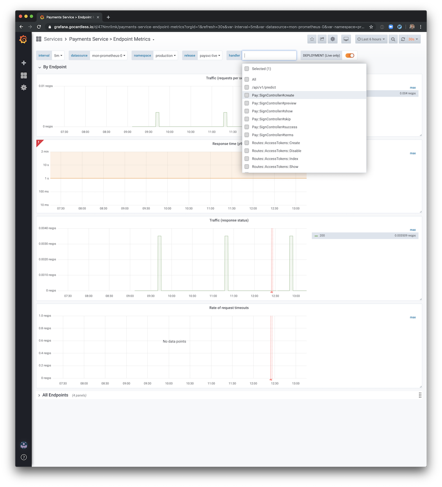
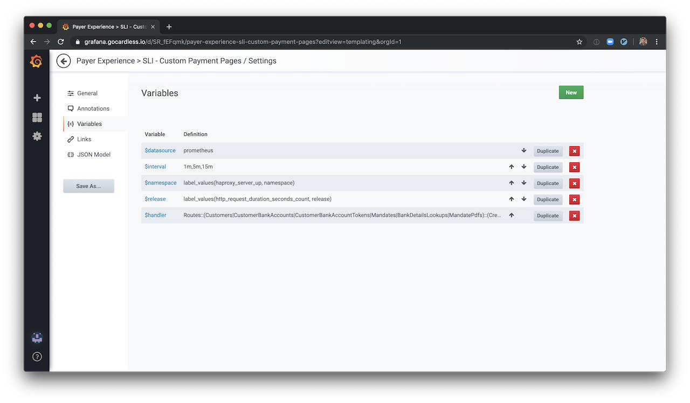

# SLIs

The easiest way to get started with setting SLIs is to abstract your system into a few common types of components. For 
each component type, there is suggested list of SLIs from which you can choose the ones most relevant to your service.

**Types of components**

Our components can be categorised as ..

- Request-driven

> The user creates some type of event and expects a response. For example, this
> could be an HTTP service where the user interacts with a browser or an API for a
> mobile application.

- Pipeline

> A system that takes records as input, mutates them, and places the output some‐
> where else. This might be a simple process that runs on a single instance in real
> time, or a multistage batch process that takes many hours. For example, Core Banking's payouts generation pipeline, 
> Banking Integration's Nexus, Data Infrastructure's Airflow DAGs.

**Types of SLIs**

After we've identified component's type then we can decide on type of SLI that is valuable to our service.

Making all of our SLIs follow a consistent style across multiple components and services allows us to take better 
advantage of tooling: we can write alerting logic, SLO analysis tools, error budget calculation, and reports to expect 
the same inputs: numerator, denominator, and threshold.

| Type of service | Type of SLI  | Description                                                  |
| --------------- | ------------ | ------------------------------------------------------------ |
| Request-driven  | Availability | The proportion of requests that resulted in a successful response. |
| Request-driven  | Latency      | The proportion of requests that were faster than some threshold. |
| Request- driven | Quality      | If the service degrades gracefully when overloaded or when backends are unavailable, you need to measure the proportion of responses that were served in an undegraded state. For example, if the User Data store is unavailable, the game is still playable but uses generic imagery. |
| Pipeline        | Freshness    | The proportion of the data that was updated more recently than some time threshold. Ideally this metric counts how many times a user accessed the data, so that it most accurately reflects the user experience. |
| Pipeline        | Correctness  | The proportion of records coming into the pipeline that resulted in the correct value coming out. |
| Pipeline        | Coverage     | For batch processing, the proportion of jobs that processed above some target amount of data. For streaming processing, the proportion of incoming records that were successfully processed within some time window. |

## How do I create a request-driven SLI?

If your API component is part of payments-service, you don't have to do anything. We are publishing stats against 
`http_request_duration_seconds` metric for all defined routes. [Endpoint metrics](https://grafana.gocardless.io/d/47Nmrilmk/payments-service-endpoint-metrics?orgId=1&refresh=30s&var-interval=5m&var-datasource=mon-prometheus-0&var-namespace=production&var-release=paysvc-live&var-handler=Routes::AdminRiskAlerts::Assign) 
dashboard will offer out of the box information on **latency**, **throughput** and **availability** for your new APIs.



If your APIs are defined outside `payment-service`, then you will have to publish your stats to Prometheus using 
`http_request_duration_seconds` histogram metric and pass the following labels:

- *handler*: Unique API endpoint identifier. In payments-service we use route's class name, e.g `Routes::Mandates::Create`
- *method*: HTTP method of the request. E.g `get`, `post`, `put`, etc
- *status*: HTTP response status code. E.g `200`, `404`, `503`, etc

For example, the following snippet describes how this is achieved in payments-service:

```ruby
# For example, the following code is used by payments-service
HttpRequestDurationSeconds = Prometheus::Client.registry.histogram(
  :http_request_duration_seconds,
  docstring: "The HTTP response duration of the application",
  buckets: API_HISTOGRAM_BUCKETS,
  labels: %i[handler method status],
)

# ...
metric_labels = {
  handler: @handler,
  status: status,
  method: env["REQUEST_METHOD"]&.downcase,
}
HttpRequestDurationSeconds.observe(
  response_time_in_seconds,
  labels: metric_labels,
)
```

You also have the option a create a custom Grafana dashboard only for APIs endpoints that are part of your service. For 
example, [Payer Experience > SLI - Custom Payment Pages](https://grafana.gocardless.io/d/SR_fEFqmk/payer-experience-sli-custom-payment-pages?orgId=1) 
is dashboard that only includes results from `http_request_duration_seconts` where `handler` matches a list of endpoints
specific only to Payer Experience.



### Examples

- Payer Experience - Hosted Payment Pages: Availability (error rate, timeouts rate), Throughput (requests/second), Latency (Response Time) 
  - [SLOs Payment Pages documentation](https://docs.google.com/document/d/1WSDuje4HDyXl3I_z1BV3u001HtNLfuZtf1nP8E2Qv6U/edit#)
  - [Grafana dashboard](https://grafana.gocardless.io/d/nVqKSDXiz/payer-experience-sli-hosted-payment-pages
    )

## How do I create a pipeline SLI?

Each pipeline components define its own metrics

### Examples

 - Core Banking: Mark Payments as Paid (Throughput SLI)
    - [Pipeline SLIs for CB documentation](https://docs.google.com/document/d/1FX3F0mny3efGnCOCvCi7DyrwzLStGbvdVd0R0vEO13w/edit#heading=h.npth3db8deri)
    - [Grafana dashboard](https://grafana.gocardless.io/d/6Bvias_ik/core-banking-mark-payments-as-paid?orgId=1&refresh=15s&from=now-12h&to=now)
 - Data Infrastructure / Dataflow failures count(Correctness SLO)
    - [Data Pipeline SLI Documentation](https://docs.google.com/document/d/1aM75ZeuCyLYP8Li4_LkG39cXJJrynnqRcpoY8hCQ2p0/edit)
    - [Grafana dashboard](https://grafana.gocardless.io/d/84RSpqjmk/gcstobigquery?orgId=1)
 - Risk & AML / Risk alert creation (Freshness SLI)
    - [SLI documentation](https://grafana.gocardless.io/d/7_iBAQCmk/airflow-dag-details?orgId=1 
      )
    - [Grafana dashboard](https://grafana.gocardless.io/d/qEHZ7S4Wz/slis-risk-alerts?orgId=1&refresh=30m)
